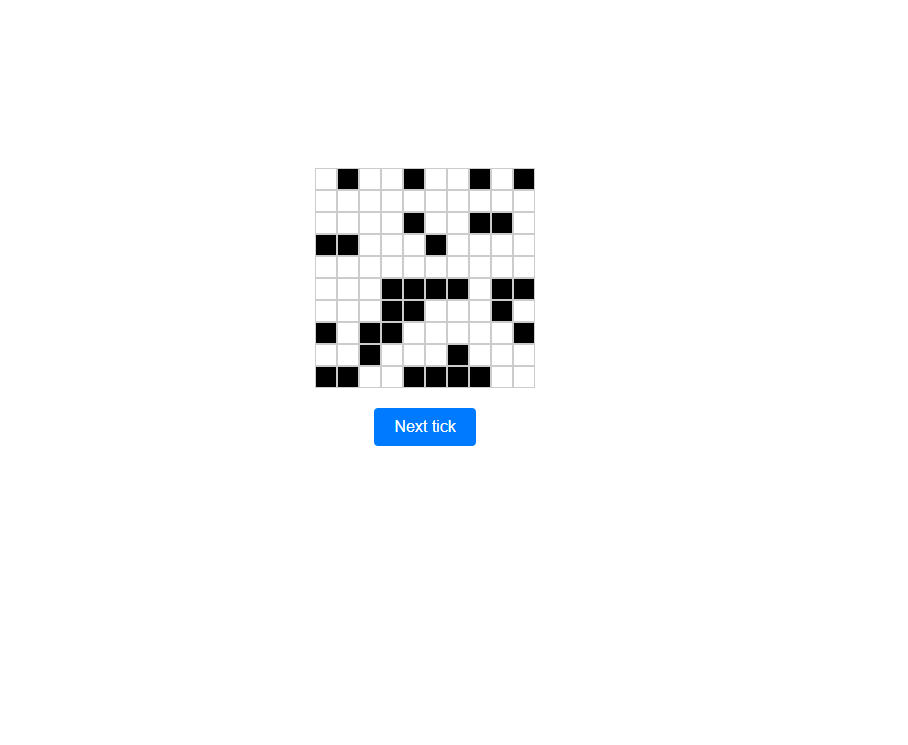

# GUI - Game of life

This project was generated with [Angular CLI](https://github.com/angular/angular-cli) version 15.2.7.

Make sure to have node and angular cli locally. If you dont, start by installing node (which includes npm):

https://nodejs.org/en/download

Then run ``npm install -g @angular/cli``

## Development server

Start by running ``npm install``

Run `ng serve` for a dev server. Navigate to `http://localhost:4200/`. The application will automatically reload if you change any of the source files.

Note that the ``angular.json`` contains a proxy config using ``proxy.conf.json`` to proxy all ``/api`` calls to
the designated backend ``localhost:8080``. We also have a pathRewrite ``"/api": "" ``

The following should be rendered locally (when you have the backend up and running)

